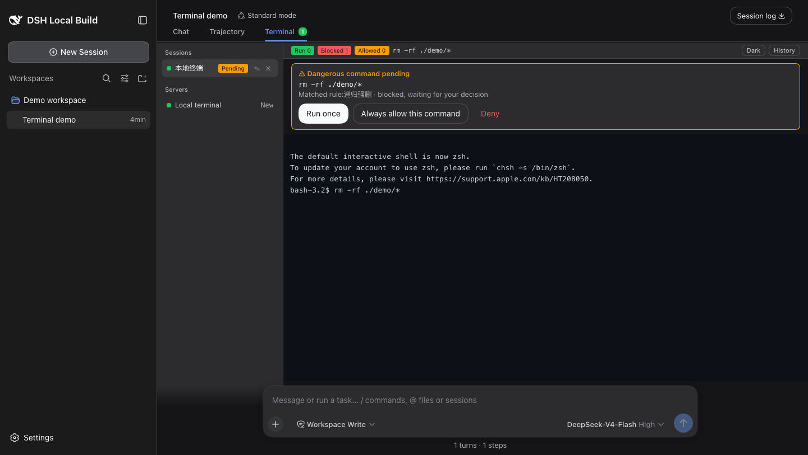

# DSH-NetShell

[English](README.en.md) · [中文](README.md)

<p align="center">
  
</p>

DSH-NetShell brings a local shell and guarded SSH sessions into DeepSeek Harness. Manage server profiles, watch live output, and let the AI run commands through a controlled tool. High-risk commands pause until you approve them.

## Why It Exists

An AI-assisted terminal needs more than an SSH connection:

- **Visibility**: human input and AI commands appear in the same live terminal panel.
- **A checkpoint**: destructive operations pause before they run.
- **Credential isolation**: SSH passwords stay in the DSH encrypted credential store and never enter AI messages, tool results, or logs.

## Install

Published package:

```bash
dsh plugin --profile web add @xgone/dsh-netshell
```

From a local checkout:

```bash
dsh plugin --profile web add link:/path/to/dsh-netshell
```

Restart DSH Web after installation. Open **Settings → Terminal**; the plugin section confirms that it is loaded.

## How To Use It

### 1. Try the local terminal

Open the **Terminal** tab in the main area. In the left panel, click **New** on the **Local terminal** row. NetShell selects an available `bash`, `sh`, PowerShell, or `cmd` on the current device. It does not read remote profiles or SSH passwords.

### 2. Add a remote server

Open **Settings → Terminal → New** and enter:

1. Name, host, port, and username;
2. An authentication method: password, private key, or `ssh-agent`;
3. A permission level; keep the default `guarded` for a first connection;
4. Optional server-specific rules.

A saved password is shown only as configured status and is never displayed again. Return to the **Terminal** tab and click **Connect** on the server row.

### 3. Handle risky commands

Commands are checked when you press Enter. Each rule has one of three actions:

| Action | Result |
| --- | --- |
| `allow` | Run immediately |
| `ask` | Pause and wait for your decision |
| `deny` | Block without running |

Permission levels:

| Level | Best for |
| --- | --- |
| `open` | Everyday use; hard-deny rules still apply |
| `guarded` (default) | Normal servers; risky commands need approval |
| `locked` | Sensitive servers; only explicitly allowed commands run directly |

For an `ask` command, choose **Run once**, **Always allow this command**, or **Deny**. A permanent allow rule applies only to the current server and exact command text.

### 4. Review status and history

The terminal footer shows run, blocked, and allowed counts. Open **History** to review command and decision records. Switching to another DSH tab does not disconnect a background session.

## Feature Screenshot



## AI Access

The plugin exposes two model tools:

| Tool | Purpose |
| --- | --- |
| `netshell_servers` | List server profiles without passwords |
| `netshell_run` | Run one command on a selected server |

AI commands and human input use the same Guard. `deny` commands never run, and `ask` commands require a decision from you in the DSH confirmation UI or terminal panel. The AI cannot see passwords or forge approval results.

## Security Boundary

This is an operation guard, not a complete security sandbox. It protects commands entering through this plugin's terminal and `netshell_run`; SSH connections created by other plugins or generic shell tools are outside its scope. Use `locked` for sensitive environments and review actions inside interactive programs carefully.

SSH host keys are stored in the plugin-private `~/.dsh/netshell/known_hosts`, separate from the user's `~/.ssh/known_hosts`.

## Documentation

- [中文 README](README.md)
- [Updates](UPDATES.md)
- [Technical notes](TECHNICAL.md)
- [Dynamic loading guide](DYNAMIC.md)
- [Design and host-contract notes](DESIGN.zh.md)
- [Full historical changelog](CHANGELOG.md)

## FAQ

**What should I check when a connection fails?** Verify the host, port, username, and authentication method. If the host key changed, confirm the server was intentionally rebuilt before removing the stale entry from the plugin-private `known_hosts` file.

**Can the AI see my password?** No. The Host reads it from DSH's encrypted credential store only while establishing SSH; profile listings, tool results, logs, and terminal output never contain the password value.
