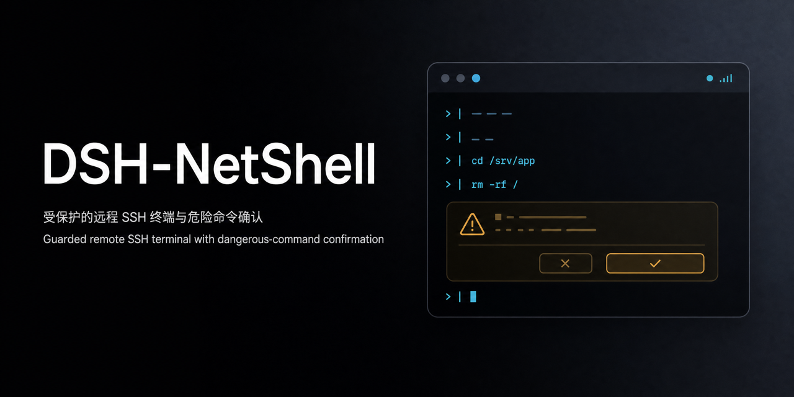

# NetShell — DSH 远程终端插件

  

在 DSH 界面里直接操作远程服务器的 SSH 终端:主区域「远程终端」Tab(左会话列表 + 右终端的分栏布局)、危险命令拦截确认、密码存入 DSH 加密凭据库且**完全不经过 AI 会话**。内置两个模型工具(`netshell_servers` / `netshell_run`),AI 可以帮你执行远程命令,但每一条都要经过与人工输入相同的权限护栏。

> **分支说明**:`master` = Loader 静态包(推荐,装一次永久生效);`dev` = 动态加载形态(开发调试,改动即时生效)。两种形态由同一份源码生成,功能一致。

## 功能一览

- **服务器档案管理**:名称 / 主机 / 端口 / 用户名,支持密码、私钥、ssh-agent 三种认证方式
- **密码隔离**:密码存入 DSH 加密凭据库,连接瞬间由插件直接注入 SSH,不进 AI 会话、不进日志
- **实时终端**:主区域「远程终端」Tab(「对话 / 轨迹」右侧,标签带状态圆点:灰 = 未连接,绿 = 已连接,数字 = 连接数,agent 通信时闪烁),自绘 ANSI 渲染(颜色、进度条、清屏),深色 / 浅色两套终端配色,闪烁光标;Tab 内容左右分区 — 左侧会话 / 服务器列表,右侧终端;切走 Tab 后会话后台保活
- **本地终端**:服务器列表置顶「本地终端」入口,使用当前设备可用的 bash / sh / PowerShell / cmd 创建独立本地会话;重复点击可创建多个本地会话,不读取服务器档案或 SSH 密码
- **会话管理**:会话悬停即可重命名 / 删除(活跃会话先断开再移除),支持拖拽排序
- **危险命令护栏**:`open / guarded / locked` 三级权限 + 内置危险规则库 + 每服务器自定义规则
- **拦截确认**:命中 `ask` 规则的命令先拦下,「执行一次 / 永久放行该命令 / 拒绝」三选一;AI 触发的确认走 **DSH 原生问题 UI,直接弹在对话窗口内**——由插件直调宿主提问服务、原地等待真人作答,答案不经模型转述,无法代答;弹卡不可用(子代理 / 无界面)时回退到终端面板横幅裁决。手动在终端敲的命令仍在终端内确认
- **命令历史**:底栏实时统计执行 / 拦截 / 放行次数,可展开查看带时间戳的完整历史
- **AI 受控接入**:模型工具与人共用同一套 Guard,`deny` 直接拦截,`ask` 必须人工确认后才执行

## 快速开始(动态加载形态)

将 `src/nsh-host.js` 与 `src/nsh-client.js` 作为动态插件的 **Host / Client 两个半区**加载进 DSH:改动即时生效、随进程消失,适合开发调试;每次重启后需重新加载激活。

> **新会话 / AI Agent 请先读 [DYNAMIC.md](DYNAMIC.md)**——完整的动态加载操作手册:精确的调用序列、参数模板、激活前逐字节校验方法,以及全部踩坑记录(idPrefix 限制、超长行截断、必须两个半区同包内联等)。照做即可一次加载成功。

> **分支与合并**:本分支按**动态加载模式**使用。分支上同样保留打包文件(`package.json` / `lib/` / `scripts` 等),为的是与 `master` 的合并路径始终干净——**发布与打包相关改动请在 master 进行**,dev 上只改 `src/` 源码与文档。面向使用者的 Loader 安装(master 形态):`dsh plugin --profile web add link:<本仓库路径>`。

加载成功后:主区域出现「远程终端」Tab(「对话 / 轨迹」右侧),设置页出现「远程终端」分区。

### 添加服务器

打开 **设置 → 远程终端 → + 新增**:

1. 填写**名称、主机、端口、用户名**(前三项必填,端口默认 22);
2. 选择**认证方式**:
   - **密码**:保存时写入加密凭据库;服务器列表里的绿点表示密码已设置;
   - **私钥**:填写本机私钥路径(如 `~/.ssh/id_ed25519`);
   - **ssh-agent**:使用本机 agent 中已加载的密钥;
3. 选择**权限等级**(不确定就保持默认 `guarded`,见下文);
4. 可选:添加**服务器规则**,优先级高于内置规则库;
5. 保存。已设置密码的服务器再次编辑时,密码框留空表示「保持不变」,也可勾选「清除已存密码」。

### 连接

- 打开主区域「远程终端」Tab,在左侧「服务器」列表点击置顶的「本地终端」即可创建本地会话;重复点击会创建多个独立会话;
- 远程服务器可在左侧「服务器」列表点「连接」;或在设置页直接点「连接」;
- 本地会话按当前系统自动选择 bash / sh / PowerShell / cmd,远程会话仍使用 SSH 档案和凭据;
- 每次连接都会开一个新会话,左侧「会话」列表可切换,彩色圆点表示状态(绿 = 在线,黄 = 连接中,红 = 已结束);
- 会话行悬停出现「✎ 重命名 / ✕ 删除」;按住行可拖拽调整顺序;删除活跃会话会先断开连接;
- 终端底栏右侧「深色 / 浅色」一键切换终端配色(GitHub 风格两套 ANSI 色板,底色、前景、光标随主题变化);
- 切到其他 Tab 不会断开会话(后台保活);会话结束(退出、断线)会显示原因,可在左侧列表关闭移除。

## 权限等级

| 等级 | 行为 |
|------|------|
| `open` | 宽松:所有命令直接放行,仅内置 `deny` 规则(如 `rm -rf /`)仍硬拦截 |
| `guarded`(默认) | 均衡:命中 `ask` 规则的危险命令被拦下询问,`deny` 拦截,其余放行 |
| `locked` | 严格:只有规则表中 `allow` 的命令直接执行,其余一律先询问 |

**规则求值顺序**:本服务器 `deny` → 本服务器 `allow/ask` → 内置 `deny` → 内置 `ask` → 等级默认。

**匹配说明**:支持通配符 `*`(任意字符)与 `?`(单个字符),不区分大小写,整条命令参与匹配;会自动剥掉命令前的 `sudo / doas / nice / nohup / env` 再匹配一遍,所以 `sudo rm -rf /` 也逃不掉。

## 危险命令拦截

命中 `ask` 规则时命令**不会执行**,面板顶部出现黄色横幅,由你决定:

- **执行一次**:本次放行,立即执行;
- **永久放行该命令**:写入该服务器的规则表(按原文精确匹配)后执行;
- **拒绝**:丢弃该行并复位提示符,什么都不执行。

内置规则示例(完整清单见 `src/nsh-host.js` 中的 `BUILTIN_RULES`):

- `deny`(直接拦截,不可询问):`rm -rf /` 及根路径变体、`mkfs`、`dd of=/dev/*`、fork 炸弹、`chmod -R 777 /*`、覆写 `/dev/sd*` 等;
- `ask`(拦下询问):`rm -rf`、`shutdown / reboot / halt / poweroff`、`drop database / drop table`、`git push --force`、`git reset --hard`、`iptables -F`、`crontab -r`、`apt/yum remove`、`docker system prune`、`kubectl delete` 等。

## 终端面板与快捷键

- 键盘输入直接转发到远程终端;`↑ / ↓` 翻本会话命令历史,`Ctrl-U` 清行,`Ctrl-C` 弃行,`Tab` 补全透传;
- 底栏状态条:执行 / 拦截 / 放行计数 + 最近一条命令;点「历史」展开完整记录(时间 + 决策徽章 + 命令);
- AI 通过 `netshell_run` 请求执行 `ask` 命令时,确认卡直接弹在对话窗口内,插件原地等待你的选择——不选择,命令就不会执行;若当前环境无法弹卡,命令会在终端面板挂起为黄色横幅,由你在面板中点击裁决。

## AI 助手(模型工具)

| 工具 | 用途 |
|------|------|
| `netshell_servers` | 列出所有服务器档案(id、名称、主机、端口、用户名、认证方式、权限等级) |
| `netshell_run` | 在指定服务器上执行一条 shell 命令并返回输出;`server` 传 `netshell_servers` 返回的 id,`timeoutMs` 默认 30000 |

安全边界:

- 模型**看不到密码**,任何接口都不会返回密码值;
- 模型的命令与人工输入走**同一个 Guard**:`deny` 直接拦截并告知原因,`ask` 必须真人确认后执行——确认由插件直调宿主提问服务在对话窗口弹卡、原地等待你的真实答案,或回退为终端面板裁决,**授权凭证只能由你的操作产生,模型无法代答或伪造**;
- 模型执行了什么、输出了什么,全部同步显示在终端面板里,全程可见;
- 终端输入协议硬化:任何内嵌回车(`\r` / `\n`)的批量输入都会被拆段送入 Guard,不存在绕过拦截直达远端的输入形态。

## 数据与存储(为什么没有配置文件)

插件**没有独立的配置项文件**,这是刻意设计:

| 数据 | 存放位置 |
|------|---------|
| 服务器档案、权限等级、规则 | DSH 加密凭据库中的 `netshell/profiles` 记录 |
| 密码 | 每台服务器一条独立凭据记录(`NETSHELL_PW_<服务器ID>`) |
| 终端会话 | 插件进程内存(DSH 重启后会话断开,档案与密码不受影响) |
| 主机指纹(known_hosts) | 插件私有文件 `~/.dsh/netshell/known_hosts`,不写入手工 ssh 的 `~/.ssh/known_hosts` |

这样做的好处:加密落盘由宿主统一负责(权限 0600),备份 DSH 即备份全部配置,且密码天然隔离于 AI 会话之外。技术细节见 [TECHNICAL.md](TECHNICAL.md) 第 4 节。

## 常见问题

**连接失败,提示"认证失败"?** 密码错误或服务器拒绝;检查密码,确认服务器允许密码登录(部分云主机默认禁用密码登录)。

**密码认证方式连不上?** 密码注入依赖 OpenSSH ≥ 8.4 的 askpass 机制(macOS 自带版本满足);私钥 / agent 认证无此要求。

**首次连接要不要确认主机指纹?** 采用 `accept-new` 策略:新主机自动接受,指纹记录在**插件私有**的 `~/.dsh/netshell/known_hosts`(目录 0700 / 文件 0600),与手工 ssh 的 `~/.ssh/known_hosts` 互不影响;若指纹与已记录的不同(可能服务器重装,也可能被劫持),SSH 会拒绝连接,确认是重装后执行 `ssh-keygen -R <主机> -f ~/.dsh/netshell/known_hosts` 清除旧指纹再试。

**输出太多会丢吗?** 有界缓冲:宿主保留最近 160K 字符,面板保留最近 1200 行,超出部分显示「… 已省略较早的 N 行输出」。

**AI 能绕过拦截吗?** 经过本插件的通道不能:命令与人工输入共用同一个 Guard,`deny` 硬拦截,`ask` 的授权凭证只能来自你的真实操作(对话窗口确认卡 / 面板裁决),模型无法代答或伪造 `choice` 参数。但请注意三点:护栏定位是"防手滑"而非沙箱——混淆变形的命令仍可能匹配不到规则,对敏感服务器建议使用 `locked` 白名单模式;Guard 只评估"整行命令",进入交互式程序(python / mysql / vim `:!` / 嵌套 ssh)之后的操作不受评估;本插件无法约束其他通道(如通用 shell 工具直接 `ssh`),那类操作不经本插件。

## 文档索引

| 文档 | 读者 |
|------|------|
| [README.md](README.md)(本文) | 使用者 |
| [DYNAMIC.md](DYNAMIC.md) | 新会话 / AI agent,动态加载操作手册(免试错) |
| [CHANGELOG.md](CHANGELOG.md) | 所有人,版本变更记录 |
| [TECHNICAL.md](TECHNICAL.md) | 开发者 / AI agent,架构与实现细节 |
| [DESIGN.zh.md](DESIGN.zh.md) | 原始设计方案与 DSH 宿主契约调研 |
