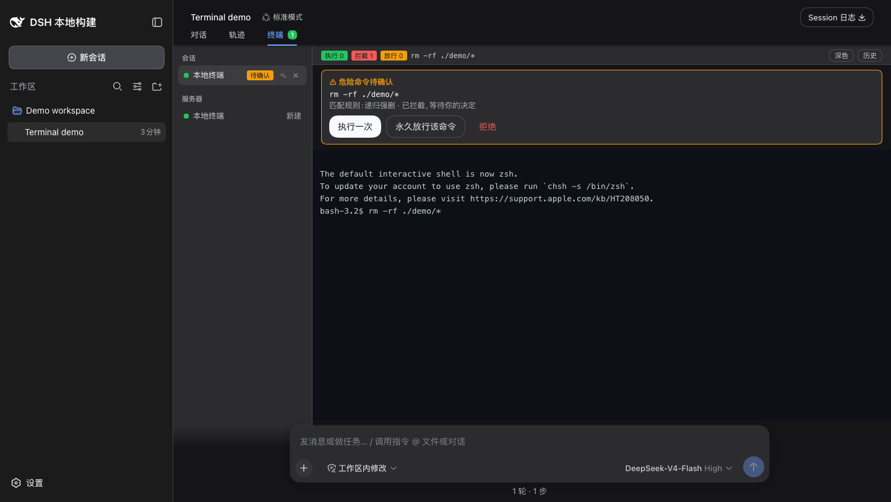

# DSH-NetShell

<p align="center">
  <a href="https://github.com/xgone/dsh-netshell/actions/workflows/ci.yml"></a>
  <a href="https://www.npmjs.com/package/@xgone/dsh-netshell"></a>
  <a href="https://www.npmjs.com/package/@xgone/dsh-netshell"></a>
  <a href="LICENSE"></a>
</p>

<p align="center">[中文](README.md) · [English](README.en.md)</p>

<p align="center">
  
</p>

<p align="center"><strong>面向 DeepSeek Harness 的受保护本地与远程 SSH 终端</strong></p>

DSH-NetShell 让你在 DSH 中管理服务器、使用实时终端，并在危险命令执行前保留一个清晰的人工确认点。人工输入和 AI 操作共用同一套命令护栏。

## 核心能力

| 能力 | 你得到什么 |
| --- | --- |
| 本地终端 | 直接启动当前设备的 `bash`、`sh`、PowerShell 或 `cmd`，无需 SSH 配置 |
| 远程 SSH | 管理主机、端口、用户和认证方式，多个会话并行运行 |
| 命令护栏 | `allow` 直接执行、`ask` 等待确认、`deny` 直接拦截 |
| 可见执行 | 人工输入和 AI 执行都实时显示在同一个终端面板 |
| 凭据隔离 | SSH 密码只进入 DSH 加密凭据库，不进入 AI 消息、工具结果或日志 |
| 命令历史 | 查看执行、拦截、放行计数和每条命令的裁决记录 |

## 安装

已发布包：

```bash
dsh plugin --profile web add @xgone/dsh-netshell
```

从本地源码安装：

```bash
dsh plugin --profile web add link:/path/to/dsh-netshell
```

安装后重启 DSH Web，然后打开 **设置 → 终端**。

## 快速开始

### 本地终端

1. 打开主区域的 **终端** Tab。
2. 在左侧 **本地终端** 行点击 **新建**。
3. 输入命令并观察实时输出。

本地终端不会读取远程服务器档案或 SSH 密码。

### 远程服务器

1. 打开 **设置 → 终端 → 新增**。
2. 填写名称、主机、端口和用户名。
3. 选择密码、私钥或 `ssh-agent` 认证。
4. 选择权限等级，第一次使用建议保持 `guarded`。
5. 回到 **终端** Tab，在服务器行点击 **连接**。

密码保存后只显示“已设置”，不会再次回显。

### 危险命令

命令在回车提交时检查：

| 等级 | 行为 |
| --- | --- |
| `open` | 日常使用；除硬拦截规则外直接执行 |
| `guarded`（默认） | 高风险命令暂停并等待确认 |
| `locked` | 只有明确允许的命令可以直接执行 |

遇到 `ask` 命令时，选择 **执行一次**、**永久放行该命令** 或 **拒绝**。永久放行只对当前服务器和当前命令文本生效。

## 界面预览



终端底栏会显示执行、拦截和放行次数；点击 **历史** 可查看本会话的命令记录。切换到其他 DSH Tab 不会主动断开后台会话。

## AI 工具

插件提供两个模型工具：

| 工具 | 用途 |
| --- | --- |
| `netshell_servers` | 列出服务器档案，不返回密码 |
| `netshell_run` | 在指定服务器上执行一条命令 |

AI 和人工输入共用同一套 Guard。`deny` 命令不会执行，`ask` 命令必须由你在 DSH 的确认卡或终端面板中裁决；AI 看不到密码，也不能伪造确认结果。

## 安全边界

这是命令操作护栏，不是完整的安全沙箱。它只保护通过本插件终端和 `netshell_run` 进入的命令；其他插件或通用 Shell 工具建立的 SSH 连接不在拦截范围内。对敏感环境建议使用 `locked`，并审查交互式程序内部执行的操作。

SSH 主机指纹保存在插件私有的 `~/.dsh/netshell/known_hosts`，不会写入用户手工 SSH 使用的 `~/.ssh/known_hosts`。

## 文档

- [English README](README.en.md)
- [更新记录](UPDATES.md)
- [技术细节](TECHNICAL.md)
- [动态加载手册](DYNAMIC.md)
- [设计方案与宿主契约](DESIGN.zh.md)
- [完整历史变更](CHANGELOG.md)

## 常见问题

**连接失败怎么办？** 检查主机、端口、用户名和认证方式。若提示主机指纹变化，确认服务器确已重装后，再按提示清理插件私有 `known_hosts` 记录。

**密码会被 AI 看到吗？** 不会。密码由 Host 侧从 DSH 加密凭据库读取，只用于建立 SSH 连接；列表、工具返回、日志和终端输出都不包含密码值。
